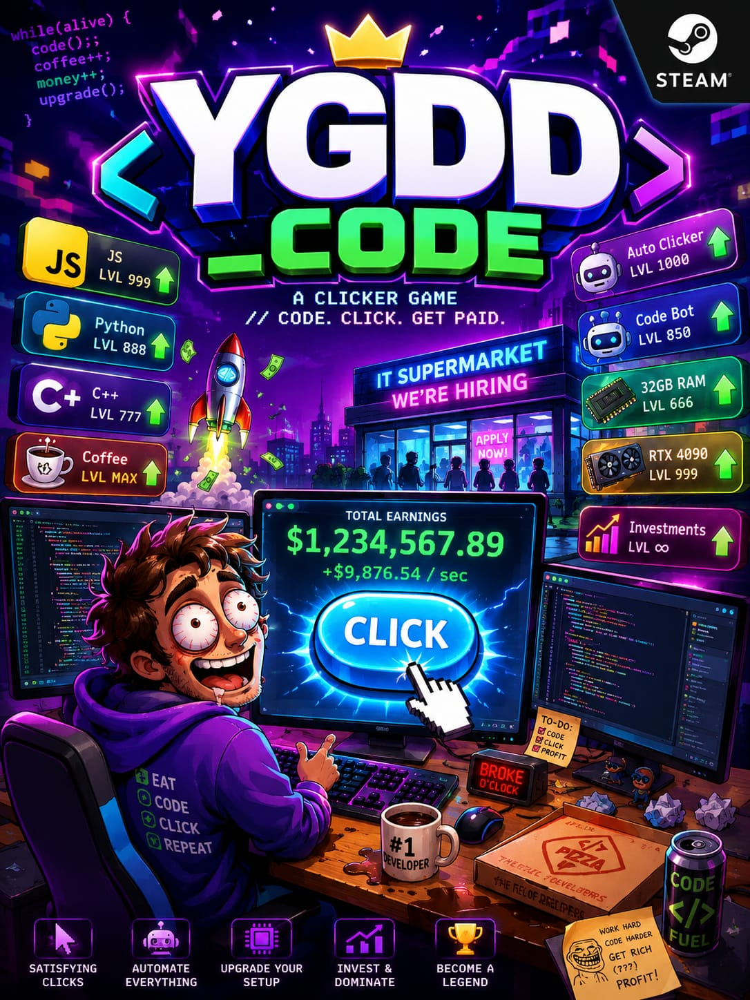

# FECAP - Fundação de Comércio Álvares Penteado

<p align="center">
<a href= "https://www.fecap.br/"></a>
</p>

# Nome do Projeto: YGGD_CODE

## Nome do Grupo: Projeto Clicker (Grupo 11)

## Integrantes: <a href="https://www.linkedin.com/in/caio-moraesdev/">Caio Moraes</a>, <a href="https://www.linkedin.com/in/enzo-gon%C3%A7alves-5a3a84320/">Enzo Augusto Pedroza Gonçalves</a>, <a href="https://www.linkedin.com/in/marcus-sousa-5029573aa/">Marcus Sousa </a>, <a href="https://www.linkedin.com/in/nicolasbmoumdjian/">Nicolas Bologna</a>, <a href="https://www.linkedin.com/in/lucas-elinou-feitosa-0894703ba/">Lucas Elinou Feitosa</a>.

## Professores Orientadores: <a href="https://www.linkedin.com/in/adriano-valente-534576135/">Adriano Felix Valente</a>, <a href="https://www.linkedin.com/in/eduardo-savino/">Eduardo Savino Gomes</a>, <a href="https://www.linkedin.com/in/remuniz/">Renata Mumiz do Nascimento</a>, <a href="https://www.linkedin.com/in/victorbarq/">Victor Bruno Alexander Rosetti de Quiroz</a>, <a href="https://www.linkedin.com/in/luisspires/">Luis Pires </a>.

## Descrição
 
 O projeto inicialmente foi criado com a ideia de ser um clicker,
com a história e temática de desenvolvedor, ele será em um estilo
parecido ao do cookie clicker, com um sistema de dinheiro, limite
de dinheiro e clicks automáticos.

 O jogo irá girar entorno de 4 principais fatores, o valor de quanto cada click da de dinheiro para o player, o limite de dinheiro que o player pode ter, os clicks automaticos e suas classes, representado por linguagens de programação, cada uma com seu bonus, todos esses fatores são upgrades são comprados pelo jogador pelo celular do personagem, onde la, ele consegue não somente acesso a seus upgrades, como a customizações em seu quarto.

 A história do jogo apesar de baseada na comédia detem de um cunho muito sério sobre a vida de programadores ao redor de todo o mundo, retratando essa falta de valorização tanto no mercado quanto na mídia.

<p align="center">
  
</p>


## 🛠 Instalação

<b>Web:</b>

Para a reprodução do jogo acesse o link abaixo!

```sh
https://caio-moraes.itch.io/yggd-code
```

## 🛠 Estrutura de pastas
```sh
-Raiz
|-->documentos
 |-->Entrega 1
   |-Algoritmos e Lógica da Programação
   |-Cálculo I
   |-Jogos Digitais 
   |-Projeto Interdisciplinar 
   |-Ética e Pensamento Computacional
 |-->Entraga 2
   |-Algoritmos e Lógica da Programação
   |-Cálculo I
   |-Jogos Digitais 
   |-Projeto Interdisciplinar
   |-Ética e Pensamento Computacional
|-->imagens
   |-CapaJogo.jepeg
|- Prototipo Projeto Clicker
|-->src
   |--> Entrega 1
      |- Backend
    |--> Entrega 2
      |- Backend
|-Banner Grupo 11.pdf
|-Documento - Projeto de Extensão - COM Empresa
|-README.md
```

## 💻 Configuração para Desenvolvimento

Como importar o projeto para dentro da Unity?
Para abrir este projeto dentro da engine da Unity, siga os seguintes passos:

Instale a Unity;

Baixe os arquivos presentes na pasta Prototipo Projeto Clicker (Download ZIP);

Va no UnityHUB com uma licença propria e um editor com a versão 6000.0.38f1 ou superior;

Clique em add -> add from disk -> abra a pasta do jogo;

Seguindo os passos você verá o jogo aberto em seu editor pronto para modificações.

## 📋 Licença/License
<a href="https://github.com/2026-1-MCC1/Projeto11">YGGD_CODE</a> © 2026 by <a href="https://www.linkedin.com/in/caio-moraesdev/,  https://www.linkedin.com/in/enzo-gon%C3%A7alves-5a3a84320/, https://www.linkedin.com/in/marcus-sousa-5029573aa/, https://www.linkedin.com/in/nicolasbmoumdjian/, https://www.linkedin.com/in/lucas-elinou-feitosa-0894703ba/">Caio Moraes, Enzo Augusto Pedroza Gonçalves, Marcus Sousa , Nicolas Bologna, Lucas Elinou Feitosa</a> is licensed under <a href="https://creativecommons.org/licenses/by/4.0/">CC BY 4.0</a>

## 🎓 Referências

Aqui estão as referências usadas no projeto.

1. <https://github.com/iuricode/readme-template>
2. <https://github.com/gabrieldejesus/readme-model>
3. <https://chooser-beta.creativecommons.org/>
4. <https://www.toptal.com/developers/gitignore>
   
